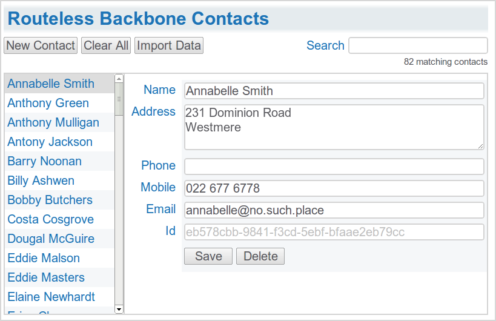
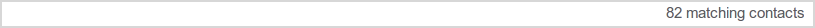
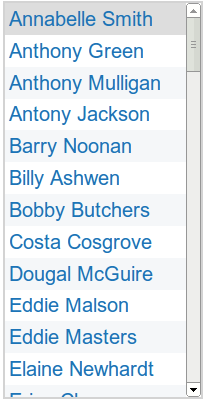
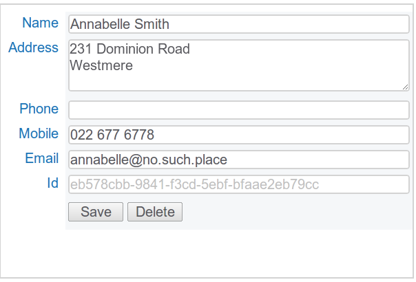

This post describes a revamped version 2.0 of my [original Routeless Backbone Contacts application](/posts/routeless-backbone-contacts). The material covered here builds on the original post.

  1. The basic application functionality and the underlying data remains the same. 
  2. The new user interface is a single two-pane page with a selectable list of contacts on the left and contact details on the right. 
  3. A _Search box_ has been added to incrementally filter the list of displayed contacts. 
  4. The application is 100% event driven -- there is no direct coupling between the views. [Backbone.js events](http://documentcloud.github.com/backbone/#Events) emitted by the underlying contact data collection ensure the views are updated automatically when the state of the underlying data changes.

<!--more-->

_Routeless Backbone.js Contacts_ is a totally client-side CRUD tutorial application written using [CoffeeScript](http://jashkenas.github.com/coffee-script/), [Stylus](http://learnboost.github.com/stylus/), [Backbone.js](http://documentcloud.github.com/backbone/) and [jQuery](http://jquery.com/) which are a perfect match for writing concise, readable well structured web applications.

  * The source is [on Github](https://github.com/srackham/routeless-backbone-contacts): 
    * This release described in this post is at the _2.0_ tag. 
    * A subsequent release includes [Selenium tests](/posts/testing-coffeescript-apps-with-selenium/) and is at the _3.0._ tag. 
  * The contacts data is persisted locally using browser [Web Storage](http://en.wikipedia.org/wiki/Web_Storage). 
  * Templates are written using [Underscore.js](http://documentcloud.github.com/underscore/) templates (included with [Backbone.js](http://documentcloud.github.com/backbone/)). 
  * Refer to the [original Routeless Backbone Contacts 1.0 blog post](/posts/routeless-backbone-contacts) for more information.

## User Interface

The single page user interface combines four [Backbone.js views](http://documentcloud.github.com/backbone/#View). The views subscribe to, and are updated by, [events](http://documentcloud.github.com/backbone/#Events) emitted by the contacts collection (_add_, _remove_, _change_, _reset_, _filter_, _select_).

## Models and Collections

### ContactModel

The same [model](http://documentcloud.github.com/backbone/#Model) as version 1.0.

### ContactsCollection

The _ContactsCollection_ [collection](http://documentcloud.github.com/backbone/#Collection) has been enhanced:

  1. The _Filter_ class provides functions to filter the collection by contact name. When the filter criteria changes the collection broadcasts a custom _filter_ event to subscribed views. 
  2. The _Cursor_ class provides a cursor object which represents the currently selected model in the contacts collection. The cursor listens for changes to the collection so that it can automatically ensure the cursor points to a valid contact in the filtered collection.  When the cursor changes the contacts collection broadcasts a custom _select_ event to subscribed views. 

## Views

### RibbonView

### StatusView

### ListView

### DetailView

## Browser Compatibility

The markup generated by this tutorial is HTML5 with CSS3, no attempt has been made to accommodate legacy browsers.

  * Was developed and tested on Google Chrome 14. 
  * Firefox 6 works fine. 
  * Requires IE9+ for correct CSS styling (though the header gradient doesn't work in IE9). 
  * Requires iOS5+ for the names [list to scroll](http://davidbcalhoun.com/2011/new-mobile-safari-stuff-in-ios5-position-fixed-overflow-scroll-new-input-type-support-web-workers-ecmascript-5). 

## Backbone.js Tips

  * The use of the _fat arrow_ function definition operator in event handlers is significant. In the following example, when _render_ is called _this_ will be bound to the callee's _this_ context so the reference to _@el_ will be correct: 

    
          @model.bind 'change', @render
          render: =>
              @el.html @template

 

  * Don't rely on the execution order of registered events. 
  * The Model _change_ event bubbles up through related collections. 
  * It pays to monitor event handler execution during development. If a section of code triggers the execution of the same handler multiple times this may be symptomatic of a non-optimal design. For example, without the _silent_ option the following code would trigger multiple collection _remove_ events (the collection _reset_ is sufficient to  ensure listener notification): 

    
        contact.destroy {silent: true} for contact in @collection.toArray()
        @collection.reset()

 

On the other hand, it's not unusual for event handlers to execute common code which can also result in execution redundancy (for example, the _renderCursor_ handler is also called by the _render_ handler in the _ListView_). In cases like this don't sweat over eliminating the redundancy unless it impacts performance -- code clarity is usually preferable to the convoluted and brittle optimisations generated by a "fix".

  * When Backbone.js Models and Collections emit built-in events they pass associated event information to the event handler arguments. The [catalog of Backbone.js events](http://documentcloud.github.com/backbone/#FAQ-events) documents the event handler arguments. Currently undocumented is fact that _options_ arguments passed to event triggering methods are passed through to the handlers as the trailing argument.  In the following example an object containing a custom option _myOption_ will be the third argument passed to the _add_ event handlers "add"(model, collection, options): 

    
        myCollection.add myModel, {myOption: 'foobar'}

 

  * Don't forget that Backbone.js event handlers are passed arguments (see previous item).  For example, the Backbone.js Collection _reset_ event passes the associated collection to the handler in the first argument which will cause the following code to fail: 

    
        @_collection.bind 'reset', @set
        set: (model=null) =>
            :

 

If you assumed that the _set_ handler would be called with no arguments you would expect _model_ to be set to _null_ -- in fact _model_ is assigned _@_collection_.  The code can be fixed by introducing an anonymous proxy handler that is bound to _this_ and called without any arguments:

    
    @_collection.bind 'reset', => @set()
    set: (model=null) ->
        :

 

  * Use the [built-in event](http://documentcloud.github.com/backbone/#FAQ-events) argument passing conventions if you have to [trigger](http://documentcloud.github.com/backbone/#Events-trigger) a built-in event programmatically. For example: 

    
        @collection.trigger 'reset', @collection

 

