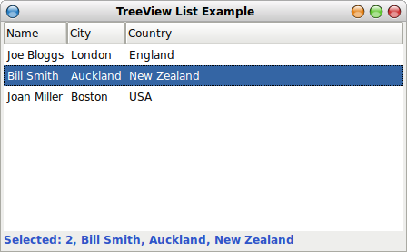

This small GTK+ example application demonstrates how to populate a [GtkTreeView](http://library.gnome.org/devel/gtk/2.90/GtkTreeView.html) list and respond to list item mouse clicks. It is written in [Vala](http://live.gnome.org/Vala/) (a functionally identical [Genie](http://live.gnome.org/Genie) version is also listed). The user interface was constructed using [Glade](http://glade.gnome.org/).

<!--more-->

The application loads and presents a list of people in a TreeView list, when a list item is selected or double-clicked the selection is displayed along the bottom of the application window. Here's a screenshot:



The [GtkTreeView](http://library.gnome.org/devel/gtk/2.90/GtkTreeView.html) widget and an associated data store object (either [GtkListStore](http://library.gnome.org/devel/gtk/2.90/GtkListStore.html) or a [GtkTreeStore](http://library.gnome.org/devel/gtk/2.90/GtkTreeStore.html)) implement tree views, lists and combinations of the two.  The TreeView is not your usual widget, it's a monster, more like a spreadsheet, expect a steep learning curve. The good new is that it is incredibly powerful.

This code was compiled and tested on Xubuntu 10.04 using Vala 0.9.8 and Glade 3.6.7.

**Vala source code (treeview-list.vala)**

```
*
    treeview-list.vala - Vala TreeView list example

    Build with:
    valac --pkg gtk+-2.0 --pkg posix treeview-list.vala
*/

static int main (string[] args) {
    Gtk.init (ref args);
    var app = new App ();
    app.start ();
    Gtk.main ();
    return 0;
}

public class App: Object {

    Gtk.Window window;
    Gtk.TreeView treeview;
    Gtk.ListStore liststore;
    Gtk.Label msg_label;

    struct Person {
        int id;
        string name;
        string city;
        string country;

        public string to_string () {
            return @"$(id), $(name), $(city), $(country)";
        }
    }

    Person[] data = {
        Person() {id=1, name="Joe Bloggs", city="London", country="England"},
        Person() {id=2, name="Bill Smith", city="Auckland", country="New Zealand"},
        Person() {id=3, name="Joan Miller", city="Boston", country="USA"}
    };

    construct {
        var builder = new Gtk.Builder();
        try {
            builder.add_from_file("treeview-list.ui");
        }
        catch (Error e) {
            stderr.printf (@"$(e.message)\n");
            Posix.exit(1);
        }
        builder.connect_signals (this);
        this.window = builder.get_object("window") as Gtk.Window;
        this.msg_label = builder.get_object("msg-label") as Gtk.Label;
        this.treeview = builder.get_object ("treeview") as Gtk.TreeView;
        // Load list data.
        this.liststore = builder.get_object ("liststore") as Gtk.ListStore;
        this.liststore.clear ();
        foreach (Person p in this.data) {
            Gtk.TreeIter iter;
            this.liststore.append (out iter);
            this.liststore.set (iter, 0, p.id, 1, p.name, 2, p.city, 3, p.country);
        }
        // Monitor list double-clicks.
        this.treeview.row_activated.connect (on_row_activated);
        // Monitor list selection changes.
        this.treeview.get_selection().changed.connect (on_selection);
        this.window.destroy.connect (Gtk.main_quit);
    }

    public void start () {
        this.window.show_all ();
    }


    private static Person get_selection (Gtk.TreeModel model, Gtk.TreeIter iter) {
        var p = Person();
        model.get (iter, 0, out p.id, 1, out p.name, 2, out p.city, 3, out p.country);
        return p;
    }

    /* List item double-click handler. */
    private void on_row_activated (Gtk.TreeView treeview , Gtk.TreePath path, Gtk.TreeViewColumn column) {
        Gtk.TreeIter iter;
        if (treeview.model.get_iter (out iter, path)) {
            Person p = get_selection (treeview.model, iter);
            this.msg_label.label = @"Double-clicked: $(p)";
        }
    }

    /* List item selection handler. */
    private void on_selection (Gtk.TreeSelection selection) {
        Gtk.TreeModel model;
        Gtk.TreeIter iter;
        if (selection.get_selected (out model, out iter)) {
            Person p = get_selection (model, iter);
            this.msg_label.label = @"Selected: $(p)";
        }
    }

}
```

**Glade XML user interface (treeview-list.ui)**

```
<?xml version="1.0"?>
<interface>
  <requires lib="gtk+" version="2.16"/>
  <!-- interface-naming-policy project-wide -->
  <object class="GtkListStore" id="liststore">
    <columns>
      <!-- column-name id -->
      <column type="gint"/>
      <!-- column-name name -->
      <column type="gchararray"/>
      <!-- column-name city -->
      <column type="gchararray"/>
      <!-- column-name country -->
      <column type="gchararray"/>
    </columns>
  </object>
  <object class="GtkWindow" id="window">
    <property name="title" translatable="yes">TreeView List Example</property>
    <property name="window_position">center</property>
    <property name="default_width">440</property>
    <property name="default_height">250</property>
    <child>
      <object class="GtkVBox" id="vbox1">
        <property name="visible">True</property>
        <child>
          <object class="GtkScrolledWindow" id="scrolledwindow1">
            <property name="visible">True</property>
            <property name="can_focus">True</property>
            <property name="hscrollbar_policy">automatic</property>
            <property name="vscrollbar_policy">automatic</property>
            <child>
              <object class="GtkTreeView" id="treeview">
                <property name="visible">True</property>
                <property name="can_focus">True</property>
                <property name="model">liststore</property>
                <child>
                  <object class="GtkTreeViewColumn" id="treeviewcolumn1">
                    <property name="title">Name</property>
                    <child>
                      <object class="GtkCellRendererText" id="cellrenderertext1"/>
                      <attributes>
                        <attribute name="text">1</attribute>
                      </attributes>
                    </child>
                  </object>
                </child>
                <child>
                  <object class="GtkTreeViewColumn" id="treeviewcolumn2">
                    <property name="title">City</property>
                    <child>
                      <object class="GtkCellRendererText" id="cellrenderertext2"/>
                      <attributes>
                        <attribute name="text">2</attribute>
                      </attributes>
                    </child>
                  </object>
                </child>
                <child>
                  <object class="GtkTreeViewColumn" id="treeviewcolumn3">
                    <property name="title">Country</property>
                    <child>
                      <object class="GtkCellRendererText" id="cellrenderertext3"/>
                      <attributes>
                        <attribute name="text">3</attribute>
                      </attributes>
                    </child>
                  </object>
                </child>
              </object>
            </child>
          </object>
          <packing>
            <property name="position">0</property>
          </packing>
        </child>
        <child>
          <object class="GtkLabel" id="msg-label">
            <property name="visible">True</property>
            <property name="xalign">0</property>
            <attributes>
              <attribute name="weight" value="bold"/>
              <attribute name="foreground" value="#30af5549c84f"/>
            </attributes>
          </object>
          <packing>
            <property name="expand">False</property>
            <property name="padding">2</property>
            <property name="position">1</property>
          </packing>
        </child>
      </object>
    </child>
  </object>
</interface>
```

 

**Functionally identical Genie source code (treeview-list.gs)**

```
/*
    treeview-list.gs - Genie TreeView list example

    Build with:
    valac --pkg gtk+-2.0 --pkg posix treeview-list.gs
*/

[indent=4]

init
    Gtk.init(ref args)
    var app = new App ()
    app.start ()
    Gtk.main ()

class App: Object

    window: Gtk.Window
    treeview: Gtk.TreeView
    liststore: Gtk.ListStore
    msg_label: Gtk.Label

    struct Person
        id: int
        name: string
        city: string
        country: string

        def to_string (): string
            return @"$(id), $(name), $(city), $(country)"

    data: array of Person = {
        Person() {id=1, name="Joe Bloggs", city="London", country="England"},
        Person() {id=2, name="Bill Smith", city="Auckland", country="New Zealand"},
        Person() {id=3, name="Joan Miller", city="Boston", country="USA"}
    }

    init
        var builder = new Gtk.Builder()
        try
            builder.add_from_file("treeview-list.ui")
        except e:Error
            stderr.printf(@"$(e.message)\n")
            Posix.exit(1)
        builder.connect_signals(this)
        this.window = builder.get_object("window") as Gtk.Window
        this.msg_label = builder.get_object("msg-label") as Gtk.Label
        this.treeview = builder.get_object ("treeview") as Gtk.TreeView
        // Load list data.
        this.liststore = builder.get_object ("liststore") as Gtk.ListStore
        this.liststore.clear ()
        for p: Person in this.data
            iter: Gtk.TreeIter
            this.liststore.append (out iter)
            this.liststore.set (iter, 0, p.id, 1, p.name, 2, p.city, 3, p.country)
        // Monitor list double-clicks.
        this.treeview.row_activated.connect (on_row_activated)
        // Monitor list selection changes.
        this.treeview.get_selection().changed.connect (on_selection)
        this.window.destroy.connect (Gtk.main_quit)

    def start ()
        this.window.show_all ();

    def static get_selection (model: Gtk.TreeModel, iter: Gtk.TreeIter): Person
        var p = Person()
        model.get (iter, 0, out p.id, 1, out p.name, 2, out p.city, 3, out p.country)
        return p

    /* List item double-click handler. */
    def on_row_activated (treeview: Gtk.TreeView, path: Gtk.TreePath, column: Gtk.TreeViewColumn)
        iter: Gtk.TreeIter
        if treeview.model.get_iter (out iter, path)
            p: Person = get_selection (treeview.model, iter)
            this.msg_label.label = @"Double-clicked: $(p)"

    /* List item selection handler. */
    def on_selection (selection: Gtk.TreeSelection)
        model: Gtk.TreeModel
        iter: Gtk.TreeIter
        if selection.get_selected (out model, out iter)
            p: Person = get_selection (model, iter)
            this.msg_label.label = @"Selected: $(p)"
```
