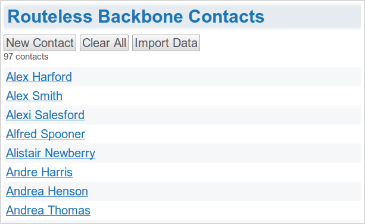
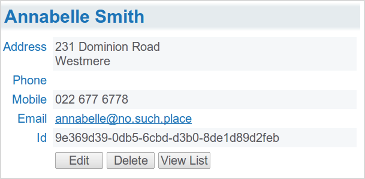
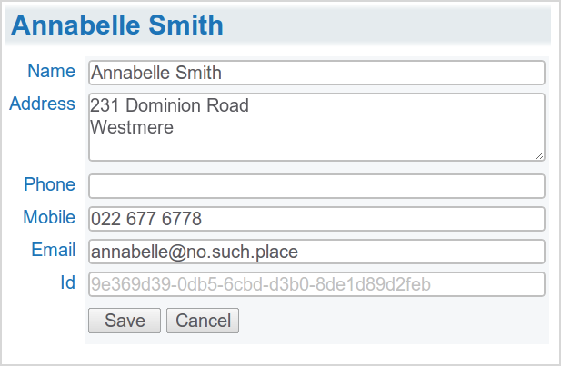

You don't need a URL router to write client-side applications.

_Routeless Backbone.js Contacts_ is a totally client-side CRUD tutorial application written using [CoffeeScript](http://jashkenas.github.com/coffee-script/), [Stylus](http://learnboost.github.com/stylus/), [Backbone.js](http://documentcloud.github.com/backbone/) and [jQuery](http://jquery.com/) which are a perfect match for writing concise, readable well structured web applications.

  * The source is [on Github](https://github.com/srackham/routeless-backbone-contacts). 

**_Note_**:
This release described in this post is at the _1.0_ tag.

  * Uses DOM events exclusively for UI navigation. 
  * The contacts data is persisted locally using browser [Web Storage](http://en.wikipedia.org/wiki/Web_Storage). 
  * Templates are written using [Underscore.js](http://documentcloud.github.com/underscore/) templates (included with [Backbone.js](http://documentcloud.github.com/backbone/)). 

**_Note_**:
A second version of this tutorial application [has been posted], it builds on the material covered in this post.

<!--more-->

## Screenshots

### ListContactView

### ShowContactView

### EditContactView

## Going routeless

It's a mindset thing. If you come from a server-side web applications background your first instinct is to use a router and [fragment identifiers](http://en.wikipedia.org/wiki/Fragment_identifier) to emulate browser page navigation -- go down this route you soon find that trying to maintain a consistent back-button browser history is time consuming, messy and ultimately unnecessary.  Single page applications don't need a back-button (or any browser chrome), especially if they are bundled as pseudo-native mobile apps with something like [PhoneGap](http://www.phonegap.com/) or packaged for the desktop, for example as [Google Chrome Packaged Apps](http://code.google.com/chrome/extensions/apps.html).

_Routeless Backbone.js Contacts_ resides at a single [unfragmented URL](http://en.wikipedia.org/wiki/Fragment_identifier) -- user interface navigation is managed exclusively by DOM events. Button and link elements deal with the click events client-side (you are not POSTing form data to a server, so _form_ elements and _submit_ buttons are not necessary).  If the application were to persist data externally then then the data POSTS and GETS would be handled transparently by a Backbone database adapter.

## Running the application

Once you have downloaded the [source from Github](https://github.com/srackham/routeless-backbone-contacts) open the index.html file in your browser. Press the _Import Data_ button to load the example contacts database.

**_Important_**:
Unlike Google Chrome, neither Firefox 6 or IE9 like persisting Web Storage from file based URLs and you will need to open the application via a web server. I use [Mongoose](http://code.google.com/p/mongoose/) (a neat little single-executable cross-platform web server) for testing.  Once you've installed _mongoose_:

  * _cd_ to the directory containing index.html
  * Then execute the _mongoose_ command and open your web browser at _localhost:8080_. 

## The source

This post should be read side-by-side with the source, it's very readable (although a basic understanding of [CoffeeScript](http://jashkenas.github.com/coffee-script/), HTML and [jQuery](http://jquery.com/) is recommended).

[index.html](https://github.com/srackham/routeless-backbone-contacts/blob/master/index.html)
     Application page HTML and view templates. 
[application.coffee](https://github.com/srackham/routeless-backbone-contacts/blob/master/js/application.coffee)
     Application, models and views. 
[data.js](https://github.com/srackham/routeless-backbone-contacts/blob/master/js/data.js)
     Canned data (100 fictitious contacts) loaded by the _Import Data_ command. 
[main.styl](https://github.com/srackham/routeless-backbone-contacts/blob/master/css/main.styl)
     Stylus CSS. 
[helpers.styl](https://github.com/srackham/routeless-backbone-contacts/blob/master/css/helpers.styl), [gradients.styl](https://github.com/srackham/routeless-backbone-contacts/blob/master/css/gradients.styl)
     CSS helper functions. 

HTML5 markup is used throughout.  All the logic is confined to [application.coffee](https://github.com/srackham/routeless-backbone-contacts/blob/master/js/application.coffee) (around 160 lines of code).  The beauty of [CoffeeScript](http://jashkenas.github.com/coffee-script/) is that the code is concise and virtually self-documenting, for example, here's the event handler in the ListContactView that responds to the _Clear All_ button click:

    
    clear: (e) ->
        return if not confirm 'About to delete all data.'
        contact.destroy() for contact in @collection.toArray()
        @render()

 

## Application structure

### The app object

There is a single global instance _app_ of the _App_ class which:

  * Initializes and namespaces global data (collections and views). 
  * Contains a few generic methods to allow programmatic inter-view navigation -- this allows views to call one another and not have to share any information about each other. 
  * Starts the application (with app.start()). 

### Models and Collections

A single app.contacts collection of Contact models is persisted locally using the [Backbone localStorage Adapter](https://github.com/jeromegn/Backbone.localStorage). A single store is instantiated and attached to the _ContactModel_, the same store is referenced by the _ContactCollection_.

### Views

The CRUD user interface is implemented by three Backbone.js views -- _ListView_, _ShowView_ and _EditView_ (the _EditView_ is also used to create new contacts).

  * Each view handles the set of DOM events defined by the View's _events_ property. 
  * The _events_ property routes DOM events to a handler within the View. 
  * When a matching DOM event occurs the View handler is called and passed a [jQuery event object](http://api.jquery.com/category/events/event-object/). 

This example (from the _ListContactView_)  uses a [custom data attribute](http://ejohn.org/blog/html-5-data-attributes/) (_data-id_) to pass the contact ID from the anchor element via a click event object.

DOM event registration:

    
    events:
        'click a.show': 'show'

 

Link click handler:

    
    show: (e) ->
        @model = @collection.get e.target.getAttribute('data-id')
        @render()

 

Template link markup:

    
    <a class="show" data-id="<%= contact.id %>"><%= contact.getName() %></a>

 

It would have been nice to have used the HTML5 DOM dataset property to retrieve the _data-id_ attribute (e.target.dataset.id) but it does not currently work in IE9, Safari or Android browsers.

### Libraries

The app uses the following JavaScript libraries (in the lib directory):

  * [Backbone.js](http://documentcloud.github.com/backbone/)
  * [jQuery](http://jquery.com/)
  * [Underscore.js](http://documentcloud.github.com/underscore/)
  * The [Backbone localStorage Adapter](https://github.com/jeromegn/Backbone.localStorage) persists models to the local disk using the browser [Web Storage](http://dev.w3.org/html5/webstorage/) API. 

## Techniques

### Load scripts at the end of the page body

Place script tags last in the page body, just before the closing body tag. This ensures the page elements elements have been parsed and can be referenced when the scripts execute and allows you to safely reference page elements from class property initializers. See [this stackoverflow discussion](http://stackoverflow.com/questions/3037725/is-it-wrong-to-place-the-script-tag-after-the-body-tag).

### Intra-application links do not need href's

Dropping the _href_ ensures there are no changes to the browser URL or history.

## CSS and HTML Tips

  * [Stylus](http://learnboost.github.com/stylus/) is to CSS as CoffeeScript is to JavaScript, use it to keep your CSS [DRY](http://en.wikipedia.org/wiki/Don’t_repeat_yourself) and to maintain your sanity. 
  * Use [Stylus imports](http://learnboost.github.com/stylus/docs/import.html) to unclutter your main CSS. 
  * CSS padding vs margins: 
    * Margins define the element's relationship to other elements (spacing) and are context specific i.e. an element's margins will change depending on where it is used in the application. 
    * Padding styles an elements appearance and isn't a context sensitive as the element margins. 
    * The _width_ property _does not include the margins, border or padding_. 
  * Use HTML5's concise syntax, it may seem wrong after years of XML indoctrination but it's not, it's easier to read and your fingers will thank you. Examples: 
    * Closing tag omission: 

                <tr><td>Foo<td>Bar                  YES
                <tr><td>Foo</td><td>Bar</td></tr>   NO

    * Minimized attributes: 

                readonly                            YES
                readonly="readonly"                 NO

    * Empty elements don't need explicit termination: 

                                  YES
                                NO

 

  * Length and size: 
    * Use em units to set size properties on elements that display text, it'll make it much easier to resize your app. 
    * To get exact placements you'll need to use pixels, but this can probably be confined to non-text elements. 
    * Use Stylus arithmetic expressions to maintain the size of interdependent page elements so that changing a single size will ensure the depend sizes are adjusted automatically (DRY again). 
  * Be careful assigning _id_ attributes in templates, do so only if the template will never appear more than once on a page. If in doubt assign _class_ attributes instead of _id_ attributes. 
  * Tables are not bad, in fact they are very good for laying out application pages (which are quite different to document oriented websites). 
  * Don't put CSS _style_ attributes in HTML template markup -- this should be obvious. 
  * Start with a clean slate, reset user-agent (browser) document oriented CSS defaults: 

        * {
          font-size: 20px;
          font-family: sans-serif;
          margin: 0;
          padding: 0;
        }

 

## References

  * E. Mathieu Sternberg's [The Backbone Store, version 2.0](http://www.elfsternberg.com/2011/08/22/backbone-store-version-20-backbonejs-coffeescript-haml-stylus-edition/). 
